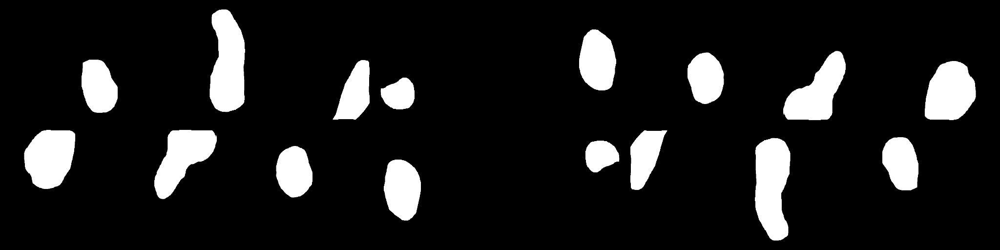

# Mean-IOU-in-Numpy-TensorFlow

Mean Intersection-Over-Union is a common evaluation metric for semantic image segmentation, which first computes the IOU for each semantic class and then computes the average over classes. IOU is defined as follows: 
<pre>IOU = true_positive / (true_positive + false_positive + false_negative). </pre>

The mean iou function defined in the above code can be used as a keras metrics in any semantic segmentation task.

# Result

The above ones are the ground truth masks, and below ones are the predicted masks.
